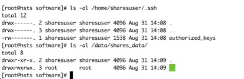
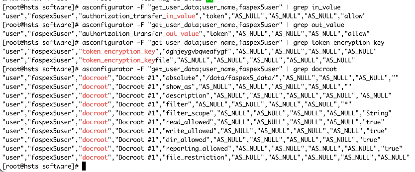

# IBM Aspera Products Lab

## 1 About this Lab

In this lab, you will learn:  
-	To install and configure HSTS.  
-	To install and configure Console.  
-	To install and configure Shares.  
-	To install and configure Faspex5.   
-	To integrate HSTS to Console, Shares and Faspex5     
-	To create users and authorize users in Shares.  
-	To create users and authorize users in Faspex5.  
-	To use different clients to transfer files.    
-	Basic Functionalities of Console.  

### References

HSTS: [https://www.ibm.com/docs/en/ahts/4.4](https://www.ibm.com/docs/en/ahts/4.4).  
Console: [https://www.ibm.com/docs/en/aspera-console/3.4](https://www.ibm.com/docs/en/aspera-console/3.4).  
Shares: [https://www.ibm.com/docs/en/aspera-shares/1.10](https://www.ibm.com/docs/en/aspera-shares/1.10).  
Faspex5: [https://www.ibm.com/docs/en/aspera-faspex/5.0](https://www.ibm.com/docs/en/aspera-faspex/5.0).  

### Software Download

All needed software can be downloaded from:   
[https://www.ibm.com/products/aspera/downloads](https://www.ibm.com/products/aspera/downloads).  
From this page, you can pick the needed software. Make sure to download linux version of the software.

### Licenses

Evaluation Licenses can be obtained from: [https://ibm.box.com/s/rvtvurpkg82n1hwwjeyp4e1p977fi1n4](https://ibm.box.com/s/rvtvurpkg82n1hwwjeyp4e1p977fi1n4).  
Evaluation licenses are normally valid till end of the month. 

### Learning Paths
There are 2 paths for learning the Aspera products here. Suggestion will be to start with Path 1 and then move on to Path 2. 

Path 1 – HSTS, Console and Shares (Estimated time: 2 hours).  
    

Click here to go to the specific section:   
[Lab Pre-requisites](#2-lab-prerequisites).     
[Install Transfer Server](#3-install-transfer-server-on-hsts-system).    
[Prepare HSTS for Console Integration](#4-prepare-hsts-for-console-integration).    
[Prepare HSTS for Shares Integration](#5-prepare-hsts-for-shares-integration).    
[Install and Setup Console](#7-install-and-setup-console-on-system-2).        
[Install and Setup Shares](#8-install-and-setup-shares-on-the-hsts-node).  
[Setting Up Email Notification - Console](#9-setting-up-email-configuration-for-console).  
[Setting Up Email Notification - Shares](#11-setting-up-email-configuration-for-shares).  
[Create and Authorize Users in Shares](#10-create-and-authorize-user-in-shares).   
[Test Various Client Options](#15-test-various-client-options).  
[Basic Functionalities of Console](#16-basic-functionalities-of-console).  

Path 2 – HSTS and Faspex5 (Estimated time: 1 hour).  
   
[Lab Pre-requisites](#2-lab-prerequisites).     
[Install Transfer Server](#3-install-transfer-server-on-hsts-system).    
[Prepare HSTS for Faspex5 Integration](#6-prepare-hsts-for-faspex5-integration).  
[Install and Setup Faspex5](#12-install-and-setup-faspex5-on-the-third-node).  
[Setting Up Email Notification - Faspex5](#13-setting-up-email-notification-in-faspex).   
[Create and Authorize Users in Faspex5](#14-create-and-authorize-faspex5-end-user).  
[Test Various Client Options](#15-test-various-client-options).  

## 2 Lab Prerequisites

1.	Three servers (physical or VM) with at least 2 cores, 8GB RAM and 10GB storage. RHEL 9.x operating system. [ This hardware spec and co-hosting of components is for lab purposes only. NOT suitable for customer environment] 
2. In this lab document, we will refer to the systems by 3 names, HSTS, Console, and Faspex.   
3.	Login to your servers using Mac terminal or Putty (Windows users). If you do not have root access, you will have to use sudo to run the commands. 
4. Make SSH listen on port 33001.   
Edit the /etc/ssh/sshd_config file (use vi for editing). Add port 33001.   

		#Port 22
		Port 33001

	Restart sshd. 

			systemctl restart sshd  
			
 	Subsequently, to ssh into the server, use the command:   
 	
	>  	ssh -p 33001 root@\<IP Address> 
 	
	 	 
 
5.	The following installation software should be downloaded and made available in a local folder (e.g. /opt/software). 

System1 (HSTS):
>    
ibm-aspera-hsts-\<version>-linux-64-release.rpm.    
ibm-aspera-shares-\<version>.x86_64.rpm.    

System 2 (Console):   
>    
ibm-aspera-common-\<version>.x86\_64.rpm.  
ibm-aspera-console-\<version>.x86\_64.rpm.  
IBM\_Aspera\_Console\_\<version>\_Linux\_Windows\_Patch\_Level\_\<version>.zip.  
There could be multiple patch files. Download all the patches.   

System 3 (Faspex):
>    
ibm-aspera-faspex-\<version>.x86\_64.rpm.  
There will also be PDF documentation files in these directories.  

6.	Licenses shoudl also be downloaded to a local foler (e.g. /opt/software).   

> shares-license-\<date>.txt in System 1.    
hsts-license-\<date>.txt in System 1.   
console-license-\<date>.txt in System 2.      
   

7. Stop and Disable Firewalld (note this is only for lab purposes – for a real install on a publicly available system, we would properly configure the firewall).  

> Check: systemctl status firewalld  
Disable: systemctl disable firewalld  
Stop: systemctl stop firewalld  

8. Set selinux to permissive.    
Edit /etc/selinux/config. Change the line that starts with “SELINUX” to the following, if not already set this way.   

	`SELINUX=permissive`.  

	If a change was made, Save the file and Reboot the machine.  
	
9.	Access to a SMTP server (Mandatory for Faspex5. Optional for Console and Shares).    
You may have to use the GMAIL configuration as described at the end of this document. Refer [here](#17-using-gmail-as-smtp-server)

## 3 Install Transfer Server on HSTS system
1.	From the folder that has the installation files, run these commands. (answer “y” to any prompts (note: these commands use wildcard characters, and assume there is only one public key zip file and one HSTS package in the /opt/software/hsts directory).  

		hostname hsts 
		cd /opt/software/  
		yum localinstall -y ibm-aspera-hsts-*-linux-64.rpm
		

2. Either copy the HSTS license you received to /opt/aspera/etc/aspera-license, or edit /opt/aspera/etc/aspera-license and paste the license key into the file and save it.
Example of copy command:

		cp /<path_to_hsts_license_file_name> /opt/aspera/etc/aspera-license
		chmod 744 /opt/aspera/etc/aspera-license

3.	Check the installation – you should see output similar to this with an expiration date in the future.

4.	Set the Transfer Node IP address and SSH Port number.  

		asconfigurator -F "set_server_data;server_name,<IP ADDRESS>;ssh_port,<PORT>"
		Example:
		asconfigurator -F "set_server_data;server_name,67.228.82.52;ssh_port,33001"
			
5.	Enable activity logging.

		asconfigurator -x "set_server_data;activity_logging,true"

6.	Create a root folder /data to be used to store transferred data.   

		mkdir /data
		chmod 777 /data

## 4 Prepare HSTS for Console Integration

The following steps are required for integrating HSTS with Console for monitoring purposes.  

1.	Turn on async activity logging.

		asconfigurator -x "set_client_data;async_management_activity_logging,true"
		asconfigurator -x "set_node_data;async_activity_logging,true"

2.	Create a transfer user (consoleuser). This user will NOT be used for any transfers. Hence, there is no need to setup token based authentication for the user. 

		useradd consoleuser
		
		Define Docroot storage for consoleuser [this is to avoid unnecessary errors in logs]
		asconfigurator -F \ "set_user_data;user_name,consoleuser;absolute,/tmp/"
		
		/opt/aspera/bin/asnodeadmin -a -u consolenodeuser -p consolenodepw -x consoleuser --acl-set "admin,impersonation"
		/opt/aspera/bin/asnodeadmin -l

We will be creating multiple Node users throughout the labs. Take note of what node user you are creating. The one we have created in the above step is the “Console Node User”.   

## 5 Prepare HSTS for Shares Integration

The HSTS will need to be configured to be integrated with Shares. 

1.	Create a transfer user (sharesuser) to be used for Shares based transfer. Setup the user for SSH Key based authentication. Set the user for token authentication and define a token. Define docroot folder for storing files.

		useradd sharesuser 
		mkdir /home/sharesuser/.ssh 
		chmod 700 /home/sharesuser/.ssh/ 
		cp /opt/aspera/var/aspera_tokenauth_id_rsa.pub /home/sharesuser/.ssh/authorized_keys 
		chmod 600 /home/sharesuser/.ssh/authorized_keys 
		chown -R sharesuser:sharesuser /home/sharesuser/.ssh
		
		Create a sub folder under /data where all transfers via shares is stored.
		mkdir /data/shares_data
		chown sharesuser:sharesuser /data/shares_data 
		
		Define Token authorization for sharesuser
		asconfigurator -F \ "set_user_data;user_name,sharesuser;authorization_transfer_in_value,token; \
		authorization_transfer_out_value,token"
		
		Set encryption key for token
		asconfigurator -F \ "set_user_data;user_name,sharesuser;token_encryption_key,<RANDOM STRING>"
		Example:
		asconfigurator -F \ "set_user_data;user_name,sharesuser;token_encryption_key,dghjeygvbqweafygf"
		
		Define Docroot storage for sharesuser
		asconfigurator -F \ "set_user_data;user_name,sharesuser;absolute,/data/shares_data/"
.

		Check the result of the above commands:
		ls -lta /home/sharesuser/
		ls -lta /home/sharesuser/.ssh/
		ls -lta /data/.  
		
.  

		asconfigurator -F "get_user_data;user_name,sharesuser" | grep in_value
		asconfigurator -F "get_user_data;user_name,sharesuser" | grep out_value
		asconfigurator -F "get_user_data;user_name,sharesuser" | grep token_encryption_key
		asconfigurator -F "get_user_data;user_name,sharesuser" | grep docroot.   
		

2.	Create a Shares Node user.   
We will be creating multiple Node users throughout the labs. Take note of what node user you are creating. The one we are creating now is the “Shares Node User”. Also, in a real situation, make sure you use a secure password for the “-p” option.

		/opt/aspera/bin/asnodeadmin -a -u sharesnodeuser -p sharesnodepw -x sharesuser
		/opt/aspera/bin/asnodeadmin -l

	

## 6 Prepare HSTS for Faspex5 Integration
The steps are pretty similar to what we did for Shares. 

1.	Create a transfer user (faspex5user) to be used for Faspex based transfer. Setup the user for SSH Key based authentication. Set the user for token authentication and define a token. Define root folder for storing packages.   

		useradd faspex5user
		mkdir /home/faspex5user/.ssh
		chmod 700 /home/faspex5user/.ssh/
		cp /opt/aspera/var/aspera_tokenauth_id_rsa.pub /home/faspex5user/.ssh/authorized_keys
		chmod 600 /home/faspex5user/.ssh/authorized_keys
		chown -R faspex5user:faspex5user /home/faspex5user/.ssh/
		
		Create a sub folder under /data where all transfers via shares is stored.
		mkdir /data/faspex5_data
		chown faspex5user:faspex5user /data/faspex5_data
		
		Define Token authorization for faspex5user
		asconfigurator -F "set_user_data;user_name,faspex5user;authorization_transfer_in_value,token;authorization_transfer_out_value,token"
		
		Set token encryption string
		asconfigurator -F "set_user_data;user_name,faspex5user;token_encryption_key,<RANDOM STRING>"
		Example:
		asconfigurator -F "set_user_data;user_name,faspex5user;token_encryption_key,dghjeygvbqweafygf"
		
		Define Docroot storage for faspex5user
		asconfigurator -F "set_user_data;user_name,faspex5user;absolute,/data/faspex5_data/"

.

		Check the result of the above commands:
		ls -al /home/faspex5user/.ssh
		ls -lta /data/faspex5_data
		
		

		asconfigurator -F "get_user_data;user_name,faspex5user" | grep in_value
		asconfigurator -F "get_user_data;user_name,faspex5user" | grep out_value
		asconfigurator -F "get_user_data;user_name,faspex5user" | grep token_encryption_key
		asconfigurator -F "get_user_data;user_name,faspex5user" | grep docroot

2.	Create a Faspex5 Node user.
We will be creating multiple Node users throughout the labs. Take note of what node user you are creating. The one we are creating now is the “Faspex5 Node User”.

		/opt/aspera/bin/asnodeadmin -a -u faspex5nodeuser -p faspex5nodepw -x faspex5user
		/opt/aspera/bin/asnodeadmin -l

## 7 Install and Setup Console on System 2

### Install Console
Install common and console rpms. (we are using wildcards for file names, ensure there is only one of each of the rpm files in /opt/software/console)

		hostname console
		cd /opt/software/
		yum install -y perl
		yum localinstall -y ibm-aspera-common-*.x86_64.rpm ibm-aspera-console-*.x86_64.rpm
		  
[Ignore any "xterm-256color" related notifications.]

		Now setup Console
		asctl console:setup
				

This takes a few minutes to complete. At the end, you will be asked to restart apache, mysql and console. Type ‘y’ to accept and restart. 
If setup was completed successfully, you will see this message.

Run this command to check the status:

		asctl all:status
		
All services should be in running status (may take a few minutes).

Install Console patches.   
Instructions to install patches will be availabile together with the patch downloaded. Unzip the patches to find instructions. In general patch installation will look like this. Please refer to the respective patches documents. 

		unzip IBM_Aspera_Console_*_Linux_Windows_Patch_Level_?.zip
		cd IBM_Aspera_Console_<version>_Linux_Windows_Patch_Level_<version>
		/bin/cp -r IBM_Aspera_Console_<version>_Linux_Windows_Patch_Level_<version>/* /opt/aspera/console/
		chown -R aspera_console:aspera_console /opt/aspera/console
		asctl console:migrate_database
		asctl console:restart

### Install License for Console

		Open the console in a browser
		https://<console IP ADDRESS>
		E.g. https://9.30.188.131
		Ignore any security risk messages (on Firefox for example “Accept the Risk and Continue”)
		Enter the username and password used during the setup. 
		
		You’ll be asked to change the password. Change the password. 
		
		Paste the contents of the Console license file [console-license-<date>.txt] (OR choose “Upload a license file” and pick the license file). 
		
		You should see a “license updated successfully” message. 

### Add HSTS as a node in Console

From the Console Web admin interface, 
Go to Nodes -> New Managed Node
Enter the IP address of the HSTS machine, change SSH port to 33001, Default Endpoint type to “Node API” and tick “Create Default Console Groups”. Leave the rest to defaults. Then click on Create.

In the next page, you will need to enter the root or an admin level SSH account details. If you do not have one, you can skip the SSH portion and fill in the NodeAPI portion. 

Enter the “Console Node User” and password created during “Prepare HSTS for Console Integration” step. This is mandatory. 
Click on Update

In the next screen click on “Test Credentials”. You should see a message saying “Sucessfully connected to node via ….”. That indicates that the Console is now ready to monitor and manage the HSTS. 

## 8 Install and Setup Shares on the HSTS node

Login to the node where we installed HSTS as root. 

1.	Install Shares (we are using wildcards for file names, ensure there is only one rpm file in /opt/software/)

		cd /opt/software/
		yum localinstall -y ibm-aspera-shares-*.x86_64.rpm

2.	Run the Shares Installer

		/opt/aspera/shares/u/setup/bin/install
		
	Wait for the installation to complete. It may take a few minutes. 

When it completes, create a Shares Web Admin username and password.

		/opt/aspera/shares/u/shares/bin/run rake aspera:admin NAME="sharesadmin" PASSWORD="admin" EMAIL="admin@nomail.com"

3.	Add an ‘AcceptedHosts’ entry
Edit this file: /opt/aspera/shares/u/shares/config/shares.yml.  [Make sure to add the host’s IP address].  

		AcceptedHosts: [<IP Address of Machine>]
		E.g. 
		AcceptedHosts: [9.30.188.131]

Restart nginx

		service aspera-shares restart
		
4.	Install License for Shares.  
Open the Shares Admin Web interface (https://\<IP address of server>) and login with the credentials created after the Shares installer script. Ignore any certificate errors (on Firefox, click “Advanced...” then “Accept the Risk and Continue”.   
You’ll be asked to change the password. Change the password. 

Paste the contents of the Shares license file [e.g. shares-license-\<date>.txt]. Click on Save.

You should see the details of the license displayed. 

5.	Update the Web Server IP Address.   
From the Shares Admin page change the web server IP address.   

Click Save when finished

6.	Add HSTS as a node in Shares.  

Click on “Home” in the upper right area and click on the plus sign to add a node. 

Enter details as described in the snapshot below. Use the “Shares Node User” created for the API Username.  

 

Click on “Test” and the status should be ‘OK’

## 9 Setting up Email Configuration for Console

Login to the Console page. Go to Notifications -> Email Server.
Enter the details. The screenshot shows an example of using Gmail. You can use your own SMTP server. Refer to [Using Gmail as SMTP server](#17-using-gmail-as-smtp-server) on how to obtain details about Gmail. 

Click on “Save Settings and send test email”. 
That should send an email to the recipient. Sample email as below.

## 10 Create and Authorize user in Shares

We will create a user and authorize the user to a specific folder. 

1.	Create a Folder.  

Login to the Shares Web Page [ https://HSTS-node-IP/ ].    
Click on the Node Created -> New Folder.   

 
Enter a name for the folder and click on “Create Folder”. The folder should be created. 

2.	Create Share.  
Create a new share that will be authorized for file transfer.
 

Then click on “Create Share”

3.	Create Shares End User.  
Create a new Shares End User. You will use this to access the Shares for transferring files.   

 

In the next screen Click on “New”.  

 

Click on “Create User”.  
Leave everything in the security tab to default.    
Click on Shares tab.   

 

We have created a Shares End User and have assigned full access for a particular share to the user. 

## 11 Setting up Email Configuration for Shares
Login to the Shares Admin page. Go to “SMTP” under Email.
Enter the details. The screenshot shows an example of using Gmail. You can use your own SMTP server. Refer to [Using Gmail as SMTP server](#17-using-gmail-as-smtp-server) on how to obtain details about Gmail.        

 
Click on “Update SMTP Server”.  
Then, click on “Send Test Email”. Enter an email address. This should send an email to the entered address. This is a sample email.   

## 12 Install and Setup Faspex5 on the third node

1.	Install docker
	
		yum install -y yum-utils
		yum-config-manager --add-repo https://download.docker.com/linux/centos/docker-ce.repo
		yum install -y docker-ce docker-ce-cli
		systemctl enable --now docker

2.	Install Faspex5 on the third node (Faspex) (we are using wildcards for file names, ensure there is only one rpm file in /opt/software/faspex)

		cd /opt/software/faspex/
		yum localinstall -y ibm-aspera-faspex-*.x86_64.rpm

3.	Setup Faspex5. 
Some default config files are here: /opt/aspera/faspex/conf/docker/. No change is needed for the test setup. 

Run the setup command:

	faspexctl setup

This will pull images, install Faspex5 and start the containers. Takes a few minutes. Note that if you’re using iTerm2 on Mac, there may be some text display oddities during install.  Do a Session->Reset if this happens.  

Check the container status:   

	faspexctl status
	

 
All containers should be in Up status.

4.Add HSTS as Transfer Node in Faspex5.  

Faspex5 is a web application. We need to add a Transfer server for file transfer purposes. 
 
On the HSTS node, create a package_storage folder under /data/faspex5_data

		mkdir /data/faspex5_data/package_storage
		chown faspex5user:faspex5user /data/faspex5_data/package_storage

Open the Faspex5 web page:   
https://\<faspex-server-IP>.  
Login with the credentials created during the Faspex5 setup process.    
You will be prompted to change password. Change the password and log back in.  Click the app switcher (9 dots) in the upper right of the window, then select the Admin app.

Click on “Nodes and Storage” -> Click on “Create Node”.  
Use the “Faspex5 Node User” created previously for the Username. Use the IP address for the HSTS node.      

In the next screen, click on “Storage Location” and click “Create Storage Location”.

Then click on “Save”.  

The next step is to make the newly added storage the default storage.    
Go to “Nodes and Storage” -> Click on the newly added node -> Click on “Storage Locations”. Check if it is the default Inbox. If not, Make it the default storage.    
*You may have to widen your browser screen if you do not see the default inbox column. *

The final step is to click on Advanced configuration and put the PUBLIC IP address of the HSTS server in field “Primary transfer address or name” then click “Save”.   

5.Enable Sending Packages to External Emails.  

For the purpose of this lab, we will allow sending packages to external emails.  This should be enabled by default. Check and enable if it is disabled. 
From the Faspex5 Admin page, Go to Security->Advanced collaboration and set the Outgoing packages->External users default to “Allow”

## 13 Setting Up Email Notification in Faspex

We will setup Email (SMTP) servers for sending notifications. You need to have access to a SMTP server to do this. Otherwise, you can make use of Gmail. Refer to [Using Gmail as SMTP server](#17-using-gmail-as-smtp-server) on how to obtain details about Gmail.   

Login to the Faspex5 Admin page. Go to Configuration -> Email Configuration.
Enter the details. The screenshot shows an example of using Gmail. You can use your own SMTP server. 

Click on Save.   
Click on “Test Email”. You will be prompted to enter an email address. Once you enter the email address, a test email will be sent to that email address. Receving the email indicates that the SMTP server details have been entered correctly. This is a sample email received.

## 14 Create and Authorize Faspex5 End user

We will create a Faspex5 End user and authorize the user to be able to send / receive packages in Faspex5.    
You need to have an Email Server setup because new users creation will involve a step of sending an email to end-user to create password. If you have not setup Email notification, refer to section “Setting Up Email Notification in Faspex” and setup now.    

Login into Faspex5 admin portal.   
https://\<Faspex-IP>/aspera/faspex/admin    

Click on Users -> All Users -> Create New.  

 
Enter the details and click create.    

When you click on Create. An email will be sent to the email address. Follow instructions to reset the password. This is a sample email sent.   

 

## 15 Test various Client Options  

### Aspera Connect (Browser Extension / Plugin)

Download Browser extension: [https://www.ibm.com/aspera/connect/](https://www.ibm.com/aspera/connect/).  

_Test from Shares._  
Open the Shares Web page in a web browser:    
https://\<shares-IP-address>/    
Login using the “Shares End User” created earlier. You may be asked to change your password during the first login. 
Trigger a transfer (refer screenshot below).   

Check the folder in HSTS. Uploaded file should be visible. 

	ls /data/shares_data/<Folder>/.  
	

_Test from Faspex5_.  
Open the Faspex5 Web page in a web browser: https://\<Faspex-IP>/    
Login using the “Faspex5 End User” created earlier. You may be asked to change your password during the first login.    
Once logged in click on “Send Files”.    

### Aspera Desktop Client
Download Link: [https://www.ibm.com/products/aspera/downloads](https://www.ibm.com/products/aspera/downloads). [ Look for IBM Aspera Desktop Client ].  

Once installed, Open the Desktop Client and Click on Connections and Add a new Connection pointing to the Shares. You will use the “Shares End User” login id and password. 

Double click on the newly created connection and it will connect to the Shares server. 

### Aspera Drive functionality, now in Aspera Connect Client

If Aspera Connect client is not running on your desktop, start it.  	
From the Menu Bar on Mac, or the System Tray on Windows, click the Connect icon and then click Preferences.    

Click on Accounts, then + in the lower left corner.  Select IBM Aspera Shares and click Next.

fill in the fields appropriate for login to your Shares instance and click Next.

Enter your End-User Shares credentials and click Next.   

Click “I’d rather not set up file syncing now” and click “Next”. (you can select a directory if you want to play with this feature, but this lab doesn’t cover that.)

Click Finish on the next page.   
Click the Connect icon in the menu bar, select browse and your shares server.

You will then see the shares you have access to.  You can click on the share and see the files and folders available in that share.  You can drag and drop files to and from this window.

### IBM Aspera For Desktop   

This is the newest client option. Download the IBM Aspera For Desktop from [https://ibmaspera.com/help/downloads/desktop](https://ibmaspera.com/help/downloads/desktop)   
Explore connecting to Faspex5.   
Reference: [https://www.ibm.com/docs/en/aspera-for-desktop/1.0.5?topic=getting-started](https://www.ibm.com/docs/en/aspera-for-desktop/1.0.5?topic=getting-started)   

### Aspera Mobile Application

IBM Aspera mobile app is available for download from PlayStore and AppStore.  
Open the respective AppStore / PlayStore and search for "IBM Aspera" application. Install the app.  
Open the app -> Touch "Link Account" -> Touch "More Aspera Enterprise apps" -> Choose which Aspera web app you want to connect to. For the lab, we will try Shares.  

Enter the details and click on "Link".   
Once you are connected to your  Shares you'll be able to upload and download files from your mobile.   

### Aspera Command-Line Interface

There are a few different types of CLIs available for file transfers.  
1. ASCLI.  
	Documents and Download: [https://github.com/IBM/aspera-cli](https://github.com/IBM/aspera-cli).   
	Supports multiple web applications as well as Aspera APIs.   
	
		Install:
		sudo gem install aspera-cli
		Check Version:
		ascli -v
		
		To browse your shares:
		ascli shares repo browse / --url=https://<Shares-IP> --username=<End-User-Username> --password=<End-User-Password>
		E.g.
		ascli shares repo browse / --url=https://shares.asperademo.com/ --username=rajan@my.ibm.com --password=secret
		
		To Upload to your shares:
		ascli shares repository upload --to-folder="<Share-Name" FileToUpload --url=https://<Shares-IP>/ --username=<End-User-Username> --password=<End-User-Password>
		E.g. 
		ascli shares repository upload --to-folder="EU upload only" 10MB.bin --url=https://shares-eu.asperademo.com/ --username=rajan@my.ibm.com --password=secret
	 
2. ASCP.  
	This tool is available as part of IBM Aspera transfer products (HSTS, HSTE, Connect and Desktop Client). Can be used to transfer directly to the transfer server.   
	[ascp - MAC](https://www.ibm.com/docs/en/asdc/4.4?topic=macos-ascp-transferring-from-command-line).  
	[ascp - Windows](https://www.ibm.com/docs/en/asdc/4.4?topic=windows-ascp-transferring-from-command-line).  
	

## 16 Basic Functionalities of Console  

Console can be used for monitoring and managing transfers, managing transfer servers, and creating reports.    
Refer to the Console Documents for the full functionalities of Console.    
Login to the Console Admin interface: https://\<Console-IP>/aspera/console/ using the admin id and password created during the install. 

### Monitoring Transfers

Go to Dashboard tab.
You will be able to monitor current transfers, recently completed transfers and recently failed transfers.   

.  

### Managing Transfer Server

Go to the Nodes tab. Click on ‘edit’ for the node. Will be able to view and make changes to the transfer server configuration. 

### Reports

Go to the Reports tab. Click on “Run a Report”.  
Pick “Activity Summary By Contact” report from the list. Click Next.   
Enter email address if you want to receive the report by email. Click “Run Report”.    
Report should be generated and emailed. 

.  

## 17 Using Gmail as SMTP server

We need to create an “App Password” in Gmail. We can then use this for setting up the SMTP server and for notification purposes.    
This link explains how to create the App Password: 
[https://support.google.com/mail/answer/185833?hl=en](https://support.google.com/mail/answer/185833?hl=en)

Once you create the App Password, you can use the following settings to connect your applications to Gmail SMTP server. 

SMTP Server: smtp.gmail.com.  
SMTP Port: 587.  
Login: Your Email address.  
Password: Use the App Password created. DO NOT use your standard Gmail password.    

 
