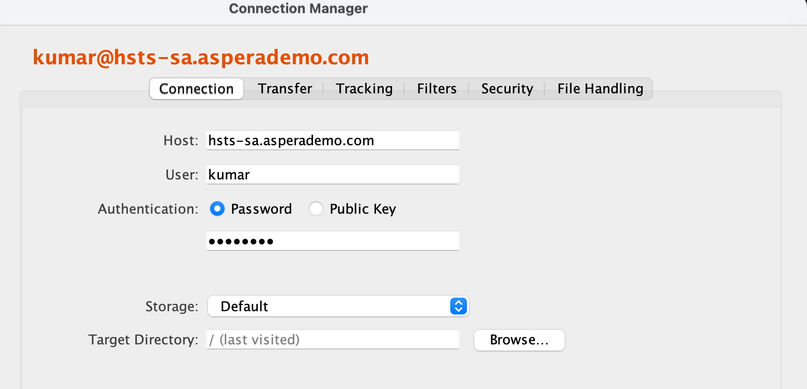

# Test Aspera Clients

The objective of this lab is try the Aspera based transfers and compare the speed of Aspera Transfers against SCP transfers (e.g. using FileZilla).   
You will also test the latest web application (Faspex 5). 

## Compare Speed

You will test transferring a file (around 100MB) using SCP [e.g. Filezilla] and also Aspera Desktop Client. 

1. First test transfer using Filezilla (or any other file transfer client).  
2. Download Install FileZilla from [here](https://filezilla-project.org/download.php?type=client).   
3. Open FileZilla and establish a connection to the Aspera Server.  Connection Details:   
	
		Protocol: SFTP
		Host: hsts-sa.asperademo.com
		Port: 33001
		Login Type: Normal    
		User: Login Id is the first part of your email. (e.g. If email is rajan.krishnan@company.com, then, username is rajan.krishnan)    
		Password: To be provided
		
	
	
	
4. Click on Connect and initiate a transfer. Take note of how long it takes to transfer.   

	

1. Next, do a similar test with. Aspera Desktop Client.   
2. Download and Install Aspera Desktop Client from [here](https://www.ibm.com/products/aspera/downloads).  
3. Open Desktop Client and establish a connection to the Aspera Server.  Connection details:

	Click on Connection and then the "+" sign.   
	
		Host: hsts-sa.asperademo.com
		User: Login Id is the first part of your email. (e.g. If email is rajan.krishnan@company.com, then, username is rajan.krishnan)
		Authentication: Choose Password
		Password: To be provided
		
	
	
1. Click on OK. Then, double-click on the connection to establish connection.  Browse to your home folder (e.g. /home/kumar).  Initiate a transfer. Click on the Details tab to check how long it took to transfer the file.   

	
	
2. Larger files will show more improvement.   

